# Explore Logics

This project is a React.js implementation of the Explore Logics professional website. The website showcases the services and information related to the Explore Logics company.

## Demo

## 

## Technologies Used

- : Frontend development framework for building user interfaces.
- : Icon library for React applications.

- : Component for animating vertical scrolling with easing effects.

- : Modern touch slider library for React.

**Project Images**

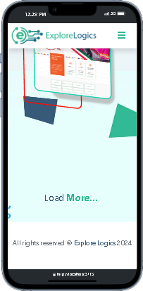
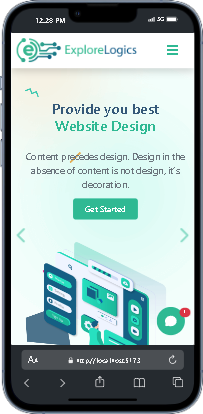
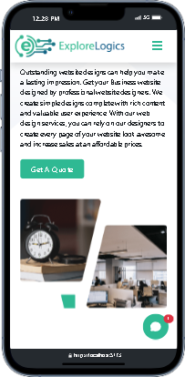
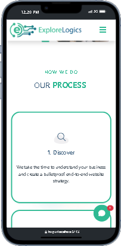
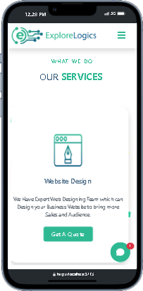

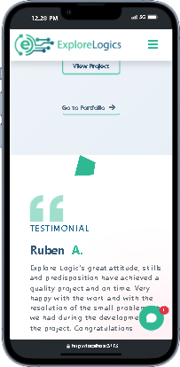
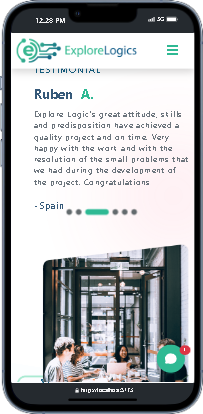
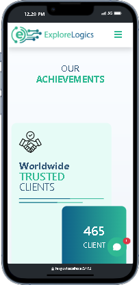

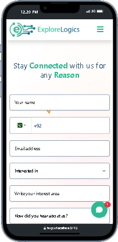
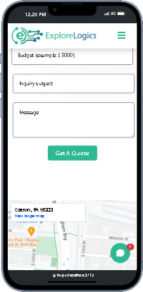
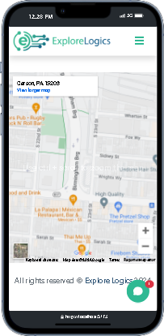
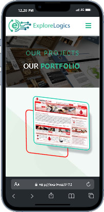
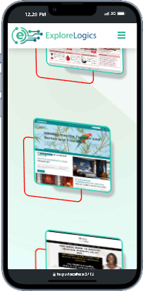
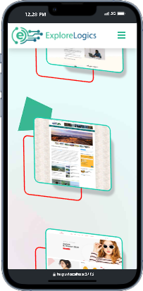

## Contributing

Contributions are welcome! If you'd like to contribute to this project, feel free to open an issue or submit a pull request.

## License

This project is licensed under the [MIT License](LICENSE).

---

## Feel free to customize the content according to your specific project details and requirements.
